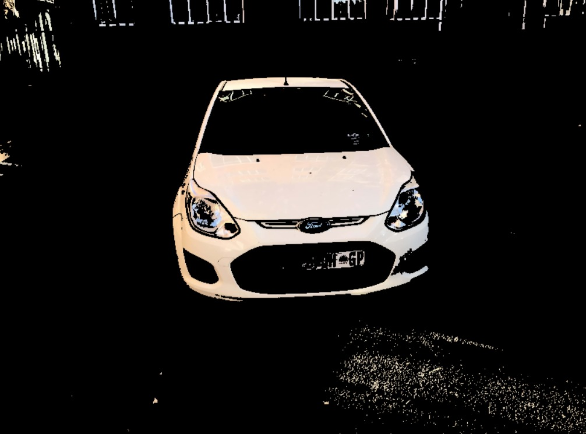
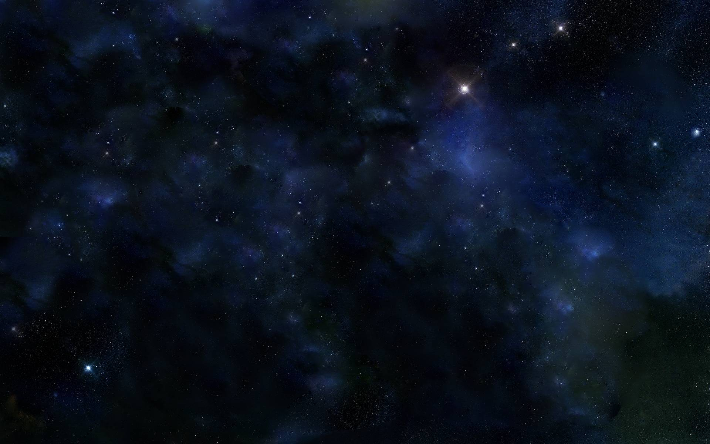
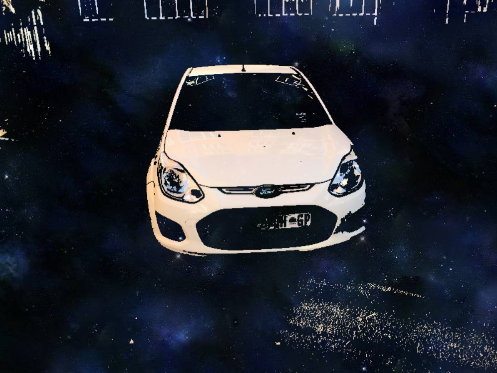

# Car-Background-Removal

The objective of this project is to remove the background of a car in an image and replace it with another background image. The process has been split into two tasks:

 - Background removal
 - Background replacement

## Background Removal

**Original Image:**

 

 
 

**Background Removed Image:**

 

 
 

## Background Replacement

**Background Image:**

 

 
 

**Background Replaced Image:**

 

